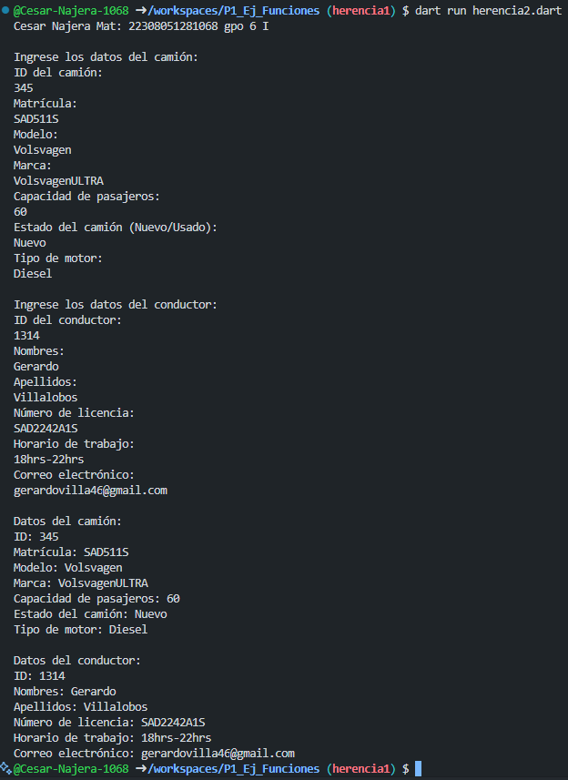

crear la clase camiones con los atributos (id_camion, matricula, modelo, marca, capacidad_pasajeros, estado_camion, tipodemotor) con una función capturadatos(), con interacción de interfaz de usuario. crear la clase DatosCamion con herencia Camiones y una función mostrardatos(). lenguaje dart tambien crear otra clase conductores con los atributos (id_conductor, nombres, apellidos, numerodelicencia, horariodetrabajo,correoelectronico) con una funcion capturadatos(), con interaccion de interfaz de usuario. crear la clase DatosConductor con herencia conductores y una funcion mostrardatos(). todo en un mismo programa

Salida de datos:
