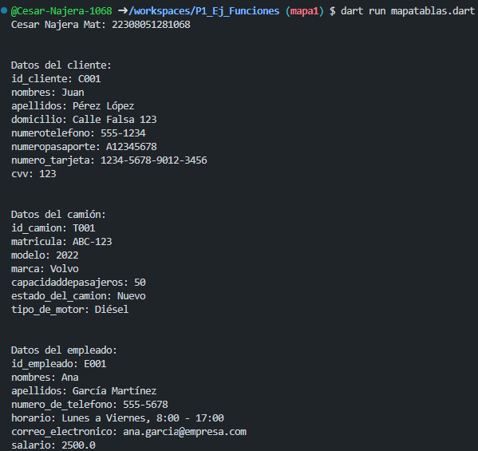

Crear un archivo en el que se incluya 3 Maps diferentes guardando datos respectivamente a las tablas de nuestro negocio 
Mi negocio: Central Camionera, Tablas que realice: Clientes, Empleados, Camiones.

1. Crear un Map <string, dynamic> clientes con los siguientes key: id_cliente, nombres, apellidos, domicilio, numerotelefono, numeropasaporte, numero tarjeta, cvv. y mostrar los datos con un foreach

2. Crear un map <string, dynamic> camiones con los siguientes key: id_camion, matricula, modelo, marca, capacidaddepasajeros, estado del camion, tipo de motor y mostrar los datos con un foreach

3. Crear un map <string, dynamic> empleados con los siguientes key: id_empleado, nombres, apellidos, numero de telefono, horario, correo electronico, salario.

Salida de datos: 
